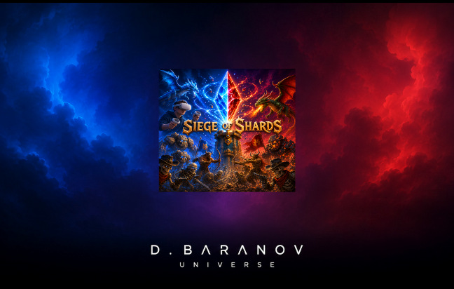
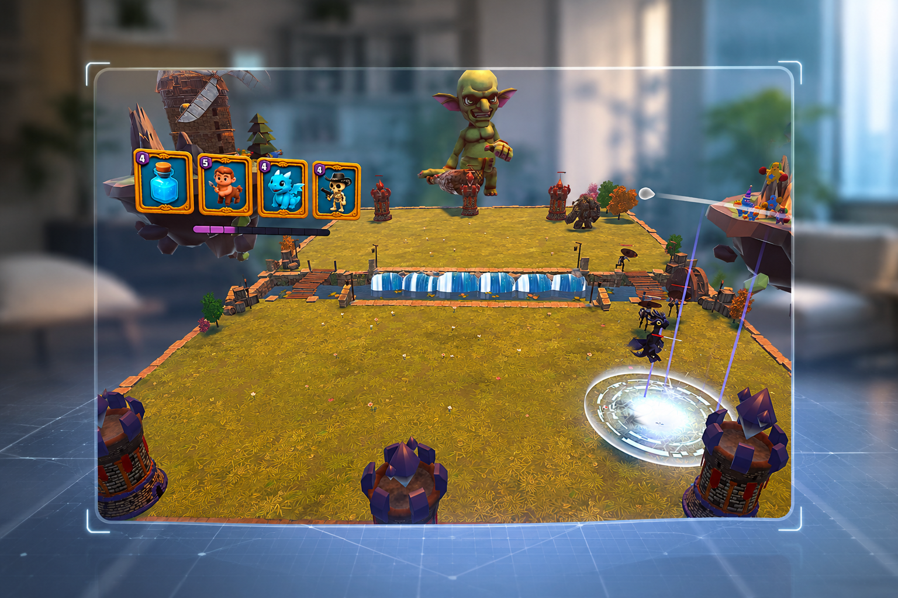
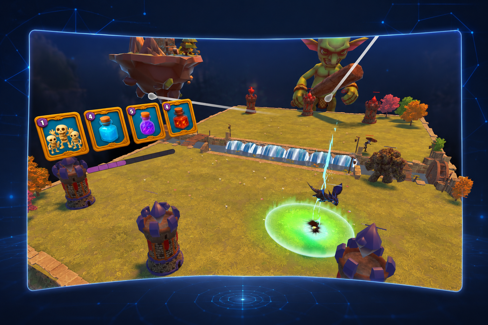
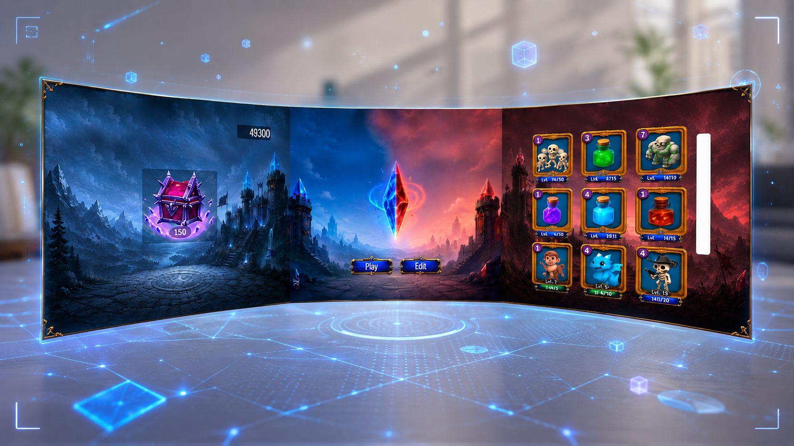

# Siege of Shards

**MR-стратегия в духе Clash Royale, где арена разворачивается прямо в вашей комнате.**
Вы стоите над полем боя в смешанной реальности, берёте карту рукой и бросаете отряд на поле. Против вас играет ИИ, который читает ситуацию на поле, а не спавнит юнитов случайно.

<p align="left">
  
  
  
  
</p>

<p align="center">
  
</p>

---

## Скриншоты

<p align="center">
  
</p>

<p align="center"><i>Арена стоит там, где вы её поставили. Комната остаётся видимой вокруг поля боя.</i></p>

| Бой вблизи | Главное меню |
|---|---|
|  |  |
| Рука из четырёх карт, полоса эликсира и круг призыва под лучом контроллера. | Колода, золото и сундуки на изогнутой панели в пространстве. |

---

## Суть матча

- Арена ставится на реальную поверхность в вашей комнате. Таймер и ИИ стартуют только после подтверждения места.
- **3 минуты**, **3 башни** на каждую сторону.
- Эликсир: старт 5, максимум 10, +1 каждые 2 секунды. Тот же лимит действует и для ИИ.
- Победа — снести все три башни соперника или сохранить больше своих к концу таймера.
- Награда за матч: победа `40 золота + сундук`, ничья `20`, поражение `10`.

## Смешанная реальность

- **Сканирование комнаты** через Meta Scene Capture и MR Utility Kit, с поиском подходящей горизонтальной поверхности.
- **Размещение арены** контроллером: полупрозрачный preview, перетаскивание, подтверждение. Событие `OnArenaConfirmed` служит стартовым сигналом для всей боевой логики.
- **NavMesh печётся в рантайме** после установки арены, поэтому навигация юнитов работает в любой комнате и на любом масштабе стола.
- **Карты — физические объекты.** Grip забирает карту из руки, луч контроллера подсвечивает точку призыва кругом, отпускание ставит отряд. Заклинания кладутся на всё поле, юниты — только в свою зону.

## Колода

Колода игрока — 8 карт, в руке 4, использованная карта уходит в конец очереди.

| Карта | Тип | Эликсир | Особенность |
|---|---|---|---|
| Skeletons | юниты | 1 | дешёвый размен, отвлечение |
| Heal | заклинание | 3 | лечение зоны |
| Cowboy | юнит | 4 | бьёт по воздуху |
| Fire Dragon | юнит | 4 | наземный, бьёт по воздуху |
| Meteor | заклинание | 4 | урон по площади |
| Explosion | заклинание | 4 | отложенный взрыв |
| Freezy | заклинание | 4 | заморозка зоны |
| Centaur | юнит | 5 | ударный наземный |
| Cold Dragon | юнит | 5 | летающий, бьёт по воздуху |
| Lazer | заклинание | 5 | направленный урон по площади |
| Golem | юнит | 7 | танк, давление на башни |

## ИИ-соперник

ИИ живёт по тем же правилам, что и игрок: та же экономика эликсира, та же циклическая колода 4 + 4.

- **BattlefieldAnalyzer** каждый тик считает численность сторон, позиции, дистанции до башен и направление атаки игрока, сводя это к пяти уровням угрозы.
- **SmartAIOpponent** выбирает одну из четырёх стратегий: `Defend`, `CounterAttack`, `Aggressive`, `EconomyBuild`.
- **AICardSelector** ранжирует карты руки по приоритету и подбирает точку призыва. Летающая атака даёт крупный бонус картам с `canTargetAir`, скопления врагов — заклинаниям.
- Резерв эликсира, задержка «раздумий» и порог пассивности игрока настраиваются в инспекторе.

## Юниты

Каждый тип юнита — своя конечная машина состояний (`Run → Attack → Death`) поверх общего `UnitStateManager` с NavMesh-агентом, аггро-радиусом и командной принадлежностью. Летающие юниты используют собственный `FlyingAgent`, который берёт путь у NavMesh, но держит высоту сам. Заморозка, лечение и зоны урона реализованы как эффекты поверх общего `Health`.

## Мета-прогресс

- Колода собирается в главном меню из полного набора карт.
- Золото и попытки открытия сундуков сохраняются между сессиями.
- Карты качаются за фрагменты: 10 фрагментов + золото поднимают уровень карты.
- Сундуки выдают фрагменты и новые карты с анимацией открытия.

## Технологии

Unity 6 (URP) · OpenXR + Meta XR SDK 81 · XR Interaction Toolkit 3.2 · AR Foundation 6.3 · MR Utility Kit · Unity AI Navigation · Cinemachine · Input System

## Структура проекта

```
Assets/Scripts/
├─ AI Opponent/      анализ поля, выбор стратегии и карт, debug-оверлей
├─ Cards/            данные карт (ScriptableObject), эликсир, XR-перетаскивание
├─ CinematicLoading/ полёт дракона поверх фоновой загрузки боевой сцены
├─ LogicBattle/      таймер матча, условия победы, награды, пауза
├─ MainMenu/         колода, золото, сундуки, прокачка карт
├─ MR/ MR2.0/ MR3.0/ сканирование комнаты и размещение арены
├─ NavMesh/          рантайм-запекание навигации
├─ Tower/            здоровье и разрушение башен
└─ Units/            FSM юнитов, здоровье, заклинания и зоны эффектов
```

Сцены: `LoadingScreen` → `MainMenu` → `BattleMatch`. Сцена `CinematicLoading` с полётом дракона поверх фоновой загрузки боя готова, но пока отключена в Build Settings.

---

© D.Baranov Universe
